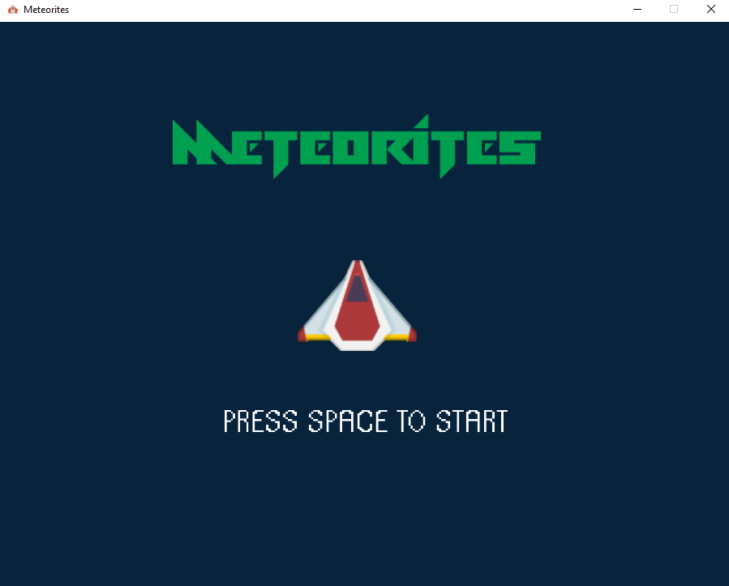
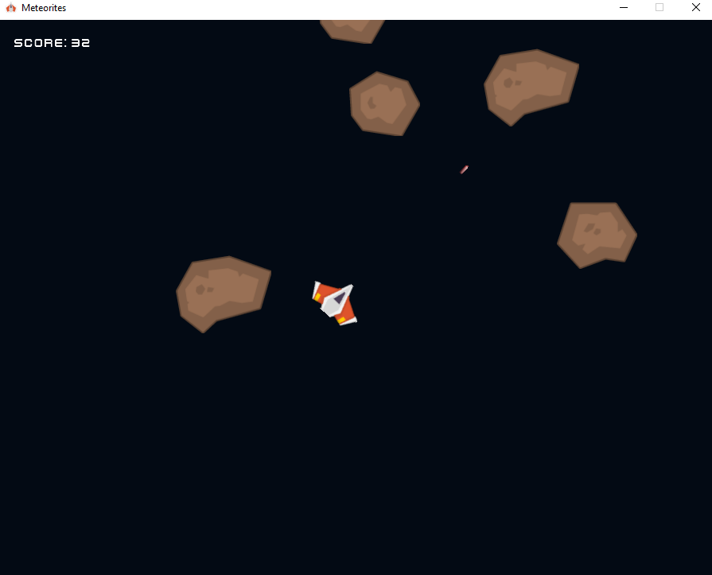
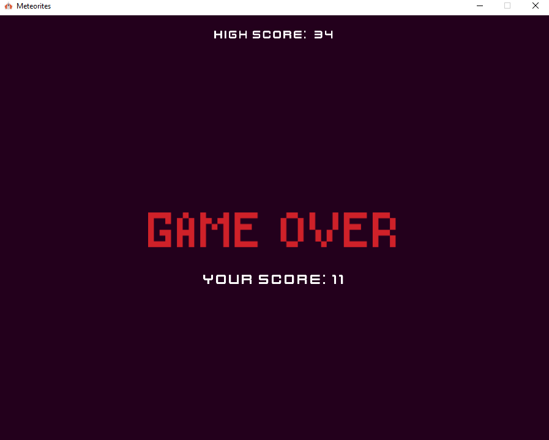

# Meteorites-Game
It is a developed version of the classic Asteroids Game, made as a final project for CS50’s Introduction to Computer Science.  
I made it using Python and Pygame engine.

---

## 💡 My Experience
I really enjoyed working on this project as it is my first project using python and pygame, beside it is my first game ever.  
Mainly, I dealt with pygame using its documentation, which is a new thing for me. Because I used to study everything about the technology before starting to use it, but here the learning and the application was at the same time.  
  
Although I didn't implement all the features I wanted or intended to, but I am happy with the final look.  
I hope you enjoy it 😀

---

## 📷 Screenshots

### Start Screen

---

### Play Screen

---

### Over Screen

---
